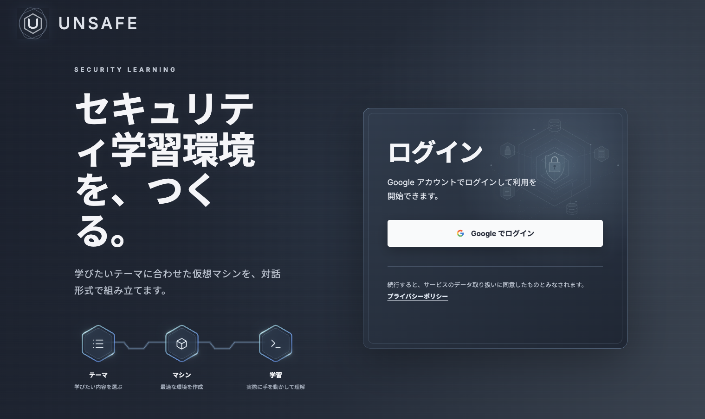

# UNSAFE

 

  

## 目次

- [UNSAFEについて](#unsafeについて)
- [今後の展望](#今後の展望)
- [構成](#構成)
  - [リポジトリ構成](#リポジトリ構成)
  - [技術スタック](#技術スタック)
  - [アーキテクチャ](#アーキテクチャ)
- [使い方](#使い方)
- [審査基準について](#審査基準について)
  - [要点](#要点)
  - [新規性](#新規性)
  - [発展性](#発展性)
  - [実現性](#実現性)
- [Contributing](#contributing)
- [License](#license)

## UNSAFEについて

ISC2の「Cybersecurity Workforce Study 2023」によると、2023年の日本のサイバーセキュリティ人材の需給ギャップは約11万人と推計されています（[ISC2の調査報告書](https://www.isc2.org/-/media/Project/ISC2/Main/Media/documents/research/ISC2_Cybersecurity_Workforce_Study_2023.pdf)、[経済産業省による紹介](https://www.meti.go.jp/press/2025/05/20250514002/20250514002.html)）。

人材を育てるには、知識を学ぶだけでなく、実際に手を動かして攻撃や防御の仕組みを理解する機会が欠かせません。一方、実践的な演習には、テーマの設定からシナリオの設計、環境の構築、動作検証まで多くの準備が必要です。課題を一つ作るにも時間と専門知識が要るため、学習者の関心や習熟度に合う課題を継続して用意するのは容易ではありません。

UNSAFE（UN-danomi Security AI Framework for Education）は、この負担を減らし、学習者に応じた実践機会を提供するサービスです。ユーザーが学びたいテーマ、難易度、フラグの条件などをチャットで指定すると、生成 AI が演習シナリオと仮想マシンのソースを作成し、検証・ビルドまでをノンストップで実行します。ビルドが完了したマシンは Web ブラウザ経由からダウンロードすることが可能で、ユーザーの環境で起動して演習を行うことができます。

自分の目的に合うマシンを作れるほか、他の利用者が公開したマシンにも挑戦できます。行き詰まったときは、マシンの詳細画面にあるヒントや誘導問題を手がかりに、解き方を考えながら学習を進められます。

## 今後の展望

より多くの学習者が目的に合う演習に取り組めるよう、次の方向で UNSAFE の発展を検討しています。

- **演習の幅を広げる**：現在の Debian ベースのマシンに加え、対応 OS や扱えるテーマを増やし、学べる技術や難易度の選択肢を広げます。
- **生成品質を高める**：シナリオ、生成したソース、完成したマシンの整合性を確認する仕組みを改善し、意図した手順で取り組める課題を安定して提供することを目指します。
- **学習支援を深める**：演習中につまずいた箇所に応じて、誘導問題をより適切に提示できるよう改善します。

これらを通じて、演習を作る負担を抑え、学習者が自分に合う課題を継続して選べる環境を目指します。

## 構成

### リポジトリ構成

フロントエンド、AI サーバー、ビルドサーバーを一つのリポジトリで管理しています。

| ディレクトリ | 役割 |
| --- | --- |
| [`frontend/`](frontend/README.md) | 画面、認証、ユーザー・マシン情報を扱うアプリケーション |
| [`ai_server/`](ai_server/README.md) | シナリオとマシンのソース生成、検証、ビルド依頼 |
| [`build_server/`](build_server/README.md) | 仮想マシンのビルドと成果物の作成 |

### 技術スタック

| 領域 | 主な技術 |
| --- | --- |
| フロントエンド |     |
| AIサーバー |    |
| ビルドサーバー |    |
| 認証 |  |
| データベース |  |

### アーキテクチャ

フロントエンドが利用者の操作を受け付け、AI サーバーがシナリオとマシンのソースを生成します。ビルドサーバーは仮想マシンを作成し、ダウンロードできる状態にします。詳しくは [システム構成](docs/spec.md) をご覧ください。

## 使い方

1. [公開デモ](https://slsg.konekotech.com) にアクセスし、Googleアカウントでログインします。
2. 公開されているマシンを選ぶか、チャット画面で学びたいテーマや難易度を指定して新しいマシンを作成します。
3. マシンのビルドが完了したら、詳細画面からダウンロードします。同梱の起動手順書に沿ってマシンを起動し、演習を始めます。
4. 必要に応じて、詳細画面のヒントや誘導問題を確認します。

## 審査基準について

### 要点

- プロダクトをインターネット公開し、誰でも利用・改良できること
- 作品による公序良俗に反する行為・権利侵害・倫理的問題はないこと

### 新規性

- 学習者が指定したテーマや難易度をもとに、生成AIが演習シナリオと仮想マシンのソースを作成できる

### 発展性

- ユーザーによる演習用マシン共有が可能であり、他のユーザーが公開したマシンを利用した学習が可能である
- ユーザーは自身の目的に合わせて演習用マシンを作成することができ、学習の幅を広げることができる

### 実現性

- チャットUI形式で演習したいマシンを作成することができ、マシンの起動方法の手順書もあるため、学習に必要な負担が少ない
- マシン詳細画面では、問題を解くのに必要なヒントを生成する機能があり、初心者でもステップバイステップで学習を進めることができる

## Contributing

このプロジェクトへの貢献を歓迎します。参加方法は [CONTRIBUTING](docs/CONTRIBUTING.md) をご覧ください。

## License

このプロジェクトは MIT License で公開されています。詳細は [LICENSE](LICENSE) をご覧ください。
