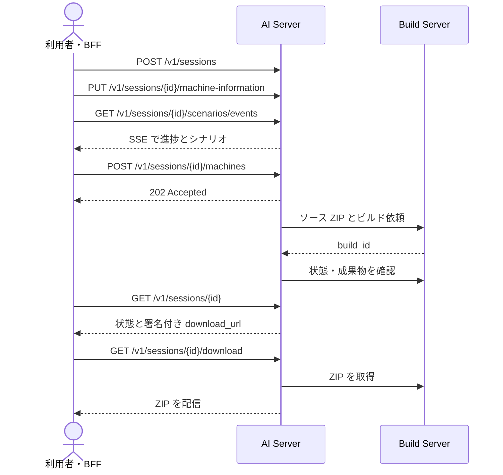
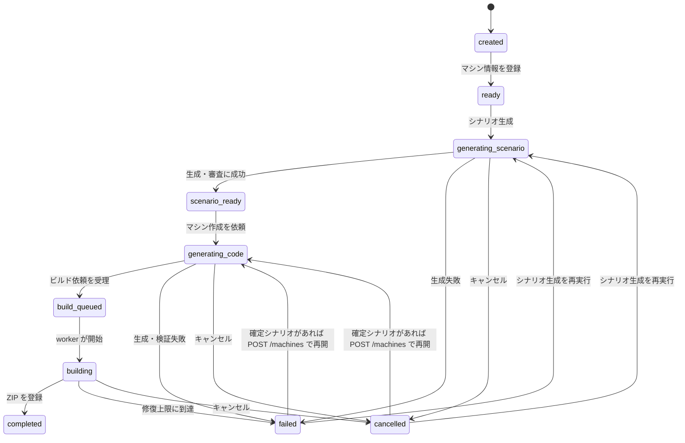

# AI Server 仕様

AI Server は、1 台の学習用マシンを作る処理を `session_id` で管理します。利用者から受け取った条件を基にシナリオと VM ソースを生成し、Build Server にビルドを依頼します。HTTP API のフィールド定義は [OpenAPI](../api/openapi.yaml) も参照してください。

## マシン作成の流れ



`POST /machines` はソース生成とビルドの完了を待ちません。処理はバックグラウンドで進みます。進捗は `GET /sessions/{session_id}` で確認します。シナリオ生成だけは SSE（Server-Sent Events）で途中経過を受け取ります。

## ユーザー識別と秘密情報

通常のセッション API では `X-Authenticated-User-ID` を指定します。作成時の値が所有者となり、別の ID で同じセッションを参照すると `404` を返します。開発用の設定では省略時に `local-user` を使います。本番利用では、認証済みの ID を BFF が付与します。

`GET /download` は例外で、このヘッダーを使いません。代わりに、発行済み URL の `expires` と `signature` を検証します。署名はセッション、ビルド、成果物、有効期限に結び付いています。期限切れや改変時は `403` です。

セッションレスポンスの `user_flag`、`system_flag` は正解値です。`machine_access.password` は完成した VM の `provisioner` ユーザーのパスワードです。いずれも秘密情報として扱い、ブラウザへそのまま渡さないでください。シナリオ本文と SSE イベントにはフラグの正解値を含めません。

## セッションの状態



`PUT /machine-information` で条件を更新すると、生成済みシナリオとソースを破棄して `ready` に戻ります。実行中は更新できません。`failed` はシナリオ生成、ソース生成、検証、ビルドの失敗をまとめて表します。`error_message` と `failure` で原因を確認します。`cancelled` は明示的なキャンセルや、プロセス再起動後に継続不能と判定された処理を表します。

`GET /sessions/{session_id}` は Build Server の最新状態と成果物を同期しますが、修復や再開を開始しません。すでに始まったバックグラウンド監視と自動修復は、クライアントがポーリングしなくても続きます。

## 生成条件を登録する

`POST /v1/sessions` はボディなしでセッションを作り、`201` と `status=created` のセッションを返します。続けて `PUT /v1/sessions/{session_id}/machine-information` に条件を送ります。

`MAX_ACTIVE_SESSIONS_PER_USER`（既定値 `1`）は同じユーザーが保持できる生成セッションの上限です。`created` からビルド中までと `scenario_ready` を使用中として数え、`completed`・`failed`・`cancelled` は数えません。新規作成や終了済みセッションの再開でも上限を適用します。新規作成と `POST /machines` の再開では `409`、シナリオ生成の SSE が開始した後の再開では `scenario.error` を返します。
上限エラーの JSON には `code=active_session_limit`、設定値の `limit`、所有者の利用中セッションを列挙した `active_session_ids` を含めます。フロントエンドはこの ID を本人のチャット一覧に照合し、続行できるチャットへのリンクを表示します。

```json
{
  "name": "Nginx Engine",
  "visibility": "private",
  "theme": "Web security",
  "difficulty": "Easy",
  "operating_system": "Debian 13.7.0",
  "needs_user_flag": true,
  "user_flag_details": "サービス調査後に user flag を取得する",
  "needs_system_flag": false
}
```

| フィールド | 内容 |
| --- | --- |
| `name` | マシン名。1～40 文字。必須。 |
| `visibility` | `private`、`public`、`非公開`、`公開`。必須。 |
| `theme` | 学習テーマ。1～500 文字。必須。 |
| `difficulty` | `Very Easy`、`Easy`、`Medium`、`High`。必須。 |
| `operating_system` | バージョン付き Debian。省略時は `Debian 13.7.0`。対応するベースイメージが必要。 |
| `needs_user_flag` / `needs_system_flag` | 作るフラグの種類。両方を省略または `null` にすると AI が選ぶ。 |
| `user_flag_details` / `system_flag_details` | 対応フラグを `true` にした場合は必須。取得条件を記述する。正解値は指定しない。 |
| `skill_names` | 使用するスキル名の任意の一覧。最大 32 件。 |
| `cve_ids` | 採用を要求する CVE ID の一覧。最大 20 件。フラグ詳細に書かれた CVE ID も取り込まれる。 |

条件の検証に失敗すると `422` です。成功時は `200` と `status=ready` のセッションを返します。

## シナリオを生成する

`GET /v1/sessions/{session_id}/scenarios/events` はシナリオ生成を始め、`text/event-stream` を返します。生成済みの有効なシナリオがあれば再生成せず、`scenario.completed` を返します。必要なマシン情報がなければ `409` です。

| イベント | 内容 |
| --- | --- |
| `scenario.started` | 生成開始。`session_id` を含む。 |
| `scenario.flags_planned` | 未指定だったフラグ構成と取得条件が決まった。 |
| `scenario.delta` | シナリオ本文の断片。`content` を含む。 |
| `scenario.completed` | 保存済みの `scenario` を返す。 |
| `scenario.error` | 生成または検証の失敗。`detail` を含む。 |
| `scenario.cancelled` | 処理のキャンセル。 |

シナリオはプレイヤー向けの `scenario_description`、設計内容を記した `definition`、攻略段階と依存関係を表す `attack_graph`、検索用の `tags` を持ちます。攻撃段階には CVE 以外の Web 脆弱性、設定不備、認証情報なども使えます。依存関係の循環や到達できないフラグ目標は拒否します。CVE を使う場合は公式レコードと対象 OS への適合性も確認します。生成後の意味的な審査を通過した案だけを保存します。攻撃グラフとシナリオの再生成は既定で最大 5 回です。ストリーム開始後の失敗は HTTP ステータスではなく `scenario.error` で通知します。

## ソース生成とビルドを依頼する

`POST /v1/sessions/{session_id}/machines` は `202` と現在のセッションを返します。ボディの `scenario_id` は省略可能です。指定した場合は、そのシナリオが同じセッションに属するか確認します。

```json
{"scenario_id":"scenario-1634ec4df6e846759cf51a8044a1401d"}
```

ソースは必須ファイル、パス、シナリオとの整合を検証します。各ビルド枠での生成と差分修正は既定で最大 3 回です。必要なフラグの配置情報から設置処理と実行時検査を組み立て、正解値を AI の修復入力から除外します。候補ソースは隔離された実行環境で検証し、意味的なレビューも通過してから ZIP にまとめて Build Server に送ります。ビルドでは VM 内の検査も実行します。

Build Server で失敗またはキャンセルされたビルドは、保存済みソースとエラーを基に差分修復し、新しいビルドとして自動的に依頼します。既定の自動修復上限は `BUILD_REPAIR_MAX_ATTEMPTS=3` です。`build_repair_attempts` は投入に成功した修復ビルドの累積回数で、ソース検証の再試行や Build Server への接続失敗では増えません。失敗後に `POST /machines` を明示的に再実行すると、新しい修復サイクルを開始できます。ソース ZIP が有効で、接続だけが失敗した場合は、その ZIP を再送します。

`POST /v1/sessions/{session_id}/cancel` は進行中の生成を止め、セッションを `cancelled` にします。完成済みセッションはキャンセルできず `409` です。

## 完成後の状態と追加 API

`GET /v1/sessions/{session_id}` はセッション全体を返します。主なフィールドは次のとおりです。

| フィールド | 内容 |
| --- | --- |
| `status` | AI Server 側の状態。 |
| `scenario` | 確定したシナリオ。生成前は `null`。 |
| `build_id` / `build_status` / `build_progress` | Build Server 側の識別子、状態、進捗。 |
| `build_repair_attempts` | 投入済みの修復ビルド回数。 |
| `source_workbench` | ソース検証中のコマンドと実行結果。未実行時は `null`。 |
| `artifact` | 完成した ZIP の ID、ファイル名、サイズ、チェックサム。 |
| `machine_access` | VM のログイン情報。秘密情報。 |
| `scenario_events_url` / `download_url` | SSE 接続先と、有効期限付きダウンロード先。 |
| `error_message` / `failure` | 失敗理由。`failure.kind=ai_safety_refusal` は再試行不可。 |

`GET /v1/sessions/{session_id}/skills` は、使用したスキル、参照情報、CVE の使用状況を返します。

完成後は `POST /v1/sessions/{session_id}/guidance` で、未取得フラグ向けの誘導問題を生成できます。ボディの `acquired_flags` は `user` と `system` の重複しない配列です。レスポンスは `introduction` と最大 8 件の `items` からなり、各項目には `target_flag`、`title`、`question`、`hint` が入ります。この API は生成結果をセッションに保存しません。未完成またはソースがない場合は `409` です。

## ZIP をダウンロードする

`completed` になったら `POST /v1/sessions/{session_id}/download-url` で新しい URL と `expires_at` を取得できます。`GET /sessions/{session_id}` の `download_url` も利用できます。有効期間は既定で 30 分です。

```sh
curl -X POST http://localhost:8000/v1/sessions/{session_id}/download-url \
  -H 'X-Authenticated-User-ID: user-123'
```

署名 URL の `GET /v1/sessions/{session_id}/download` は、Build Server の成果物を `application/zip` で配信します。ファイル名は `<artifact_id>.zip` です。`Range` による部分取得は `206`、範囲外は `416` を返します。`ETag` は成果物の SHA-256 チェックサムに基づきます。ZIP には `image.qcow2` と、Windows・macOS 向けの起動スクリプトと PDF 形式の接続手順が入ります。未完成なら URL 発行は `409` です。

## ヘルスチェックとエラー

`GET /v1/health/live` は HTTP プロセスの生存確認、`GET /v1/health/ready` は PostgreSQL を含む処理可能性の確認です。どちらも正常時は `{"status":"ok"}` を返します。ready は Build Server や AI プロバイダーの可用性を確認しません。

| HTTP 状態 | 主な発生条件 |
| --- | --- |
| `403` | ダウンロード URL の署名が無効または期限切れ。 |
| `404` | セッションが存在しない、または所有者が異なる。 |
| `409` | 現在の状態では操作できない。生成条件未登録、マシン未完成、完成後のキャンセルなど。 |
| `422` | リクエストの必須項目、形式、値の検証に失敗した。 |
| `502` | Build Server との通信または応答処理に失敗した。 |

非同期処理では、開始 API が成功した後に失敗することがあります。その場合はセッションの `status` と `error_message` を確認してください。
