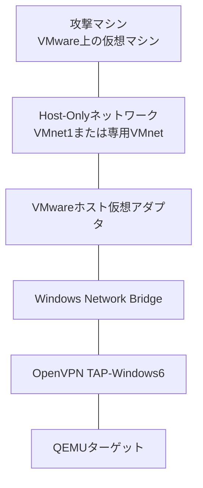
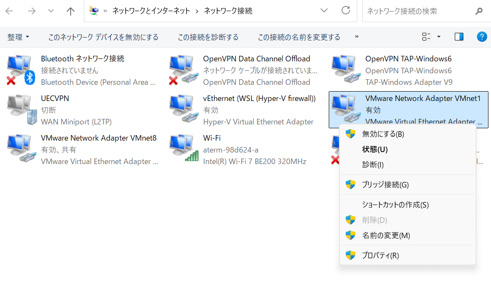
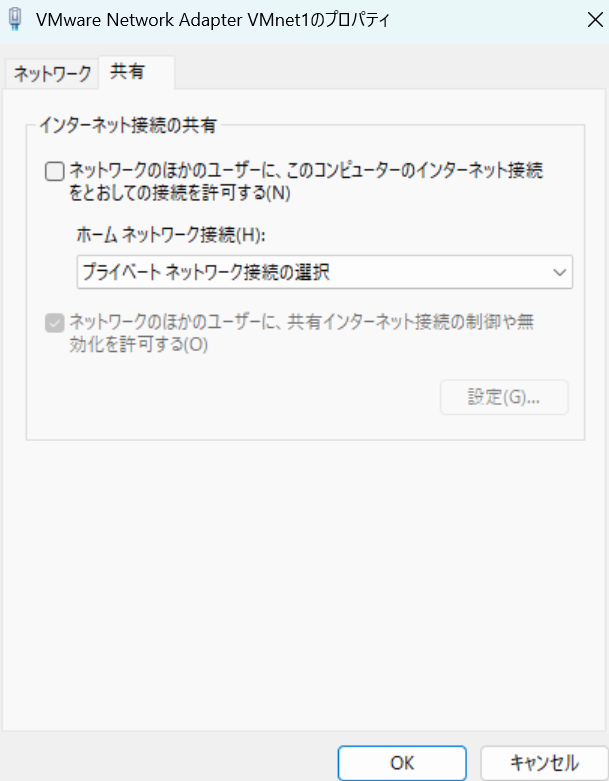

# Windowsでマシンを起動する

Windows上のQEMUでマシンを起動し、攻撃マシンから接続するための手順です。NATやポート転送は使いません。QEMUのTAPと攻撃マシンを同じHost-Onlyネットワークへ接続します。

このREADMEでは、攻撃マシンをVMWare Workstation Pro上で起動することを想定します。VirtualBoxまたはWSL上で攻撃マシンを動かす場合は、「[その他の接続構成](#その他の接続構成)」を参照してください。

## 注意事項

このマシンには脆弱なサービスが含まれています。企業LAN、公衆Wi-Fi、インターネットへ接続しないでください。

## 必要なもの

- x86_64版QEMU for Windows
- OpenVPNのTAP-Windows6アダプタ
- VMware Workstation Pro上で動作する攻撃マシン
- 4 GiB以上の空きメモリ
- ダウンロードした `<ARTIFACT_ID>.zip`

配布物を展開すると、次のファイルが同じディレクトリに配置されます。

- `image.qcow2`
- `Start-Windows.ps1`


## ネットワーク構成



攻撃マシンとQEMUターゲットは同じL2セグメントへ接続されます。ターゲットのIPアドレスは、VMwareのHost-Onlyネットワークで動作するDHCPから取得します。

## セットアップ

### 1. 配布物を展開する

空の専用ディレクトリでPowerShellを開き、ダウンロードしたZIPファイルを展開します。

```powershell
Expand-Archive .\<ARTIFACT_ID>.zip -DestinationPath .
Set-Location .\slsg-machine
```

### 2. QEMUを準備する

以下のリンクよりQEMU for Windowsをインストールし、インストール先をWindowsの環境変数 `Path` に追加します。

https://www.qemu.org/download/

標準的なインストール先は次のとおりです。

```text
C:\Program Files\qemu
```

PowerShellで次のコマンドを実行し、QEMUを起動できることを確認します。

```powershell
qemu-system-x86_64.exe --version
```

WHPXで高速に実行する場合は、「Windowsの機能」で `Windows Hypervisor Platform` を有効にし、Windowsを再起動してください。

### 3. TAPアダプタを準備する

OpenVPNのTAP-Windows6ドライバなどをインストールし、PowerShellでネットワークアダプタ名を確認します。

```powershell
Get-NetAdapter
```

以降のプレースホルダは、実際に表示された名前へ置き換えてください。

| プレースホルダ | 説明 | 既定値 |
| --- | --- | --- |
| `<VMWARE_HOST_ONLY_NETWORK>` | 攻撃マシンを接続するVMwareのHost-Onlyネットワーク名 | `VMnet1` |
| `<VMWARE_HOST_ONLY_ADAPTER>` | 上記のHost-Onlyネットワークに対応するWindows側の仮想アダプタ名 | `VMware Network Adapter VMnet1` |
| `<TAP_ADAPTER>` | QEMUが使用するWindows側のTAPアダプタ名 | `OpenVPN TAP-Windows6` |

### 4. 攻撃マシンとTAPアダプタを接続する

VMware Workstation Proの「仮想ネットワークエディタ」を管理者権限で開き、Host-Onlyネットワークを準備します。既定の `VMnet1` を使うか、専用のHost-Onlyネットワークを作成してください。

使用するネットワークでは、次の項目を有効にします。

- ホスト仮想アダプタをこのネットワークへ接続する
- ローカルDHCPサービスを使用してVMへIPアドレスを配布する

次に、攻撃マシンの仮想マシン設定を開き、ネットワークアダプタをHost-Onlyへ変更します。専用のVMnetを作成した場合は、「カスタム」から `<VMWARE_HOST_ONLY_NETWORK>` を選択してください。

Windows側では、VMwareのHost-OnlyアダプタとQEMUのTAPアダプタをネットワークブリッジへ追加します。

#### インターネット接続の共有を無効にする

ブリッジを作成する前に、対象アダプタの共有設定を確認します。

1. `Windowsキー + R` を押します。
2. `ncpa.cpl` と入力し、「ネットワーク接続」を開きます。
3. `<VMWARE_HOST_ONLY_ADAPTER>` を右クリックし、「プロパティ」を開きます。

下図は、`VMware Network Adapter VMnet1` の「プロパティ」を開く位置を示しています。



「共有」タブを開き、下図の「ネットワークのほかのユーザーに、このコンピューターのインターネット接続をとおしての接続を許可する」のチェックを外して、「OK」を押します。既にチェックが外れている場合は、設定を変更する必要はありません。



#### ネットワークブリッジを作成する

「ネットワーク接続」に戻り、次の操作を行います。

1. `<VMWARE_HOST_ONLY_ADAPTER>` と `<TAP_ADAPTER>` を `Ctrl` キーを押しながら選択します。
2. 選択したアダプタのいずれかを右クリックし、「ブリッジ接続」を選択します。
3. 「ネットワーク ブリッジ」が作成され、両方のアダプタが参加していることを確認します。

企業LANや公衆Wi-Fiなどの外部ネットワーク側のアダプタを、このブリッジへ追加しないでください。

## マシンを起動する

PowerShellで、`Start-Windows.ps1` があるディレクトリへ移動します。

```powershell
Set-Location "<MACHINE_DIRECTORY>"
```

TAPアダプタ名が既定値の `OpenVPN TAP-Windows6` であれば、次のコマンドで起動できます。

```powershell
.\Start-Windows.ps1
```

別の名前を使用している場合は、`-TapAdapter` で指定します。

```powershell
.\Start-Windows.ps1 -TapAdapter "<TAP_ADAPTER>"
```

実行例：

```powershell
.\Start-Windows.ps1 -TapAdapter "OpenVPN TAP-Windows6"
```

WHPXを使用できない場合は、TCGで起動します。

```powershell
.\Start-Windows.ps1 -Accelerator tcg -TapAdapter "<TAP_ADAPTER>"
```

起動すると、ログインプロンプトの前にターゲットのIPv4アドレスが表示されます。このアドレスは、次の手順で `<TARGET_IP>` として使用します。

## 攻撃マシンから接続を確認する

ここからは、攻撃マシンで操作します。以下のコマンドはKali Linuxでの実行例です。

QEMUのコンソールに表示されたIPアドレスを指定し、ターゲットへpingを実行します。

```sh
ping <TARGET_IP>
```

応答が返れば接続できています。pingを終了するには、`Ctrl + C` を押します。

必要に応じて、ターゲットを探索します。

```sh
sudo arp-scan --localnet
sudo nmap -Pn -sS -sV -p- <TARGET_IP>
sudo nmap -Pn -sU --top-ports 100 <TARGET_IP>
```

## マシンを終了する

QEMUのウィンドウを閉じるとマシンが終了します。

## その他の接続構成

### VirtualBox上の攻撃マシン

VirtualBox Host-Onlyネットワークを作成し、攻撃マシンのNICをそのネットワークへ接続します。

Windows側では、QEMUのTAPアダプタと、対応する `VirtualBox Host-Only Ethernet Adapter` をネットワークブリッジへ追加します。VirtualBoxのHost-Only DHCPを有効にしてください。

アダプタ名は環境によって異なるため、実際に表示された名前を確認してください。

### WSL上の攻撃マシン

QEMUのTAPアダプタを専用の有線LANアダプタへ接続し、WSL上の攻撃マシンからコンソールに表示されたターゲットIPへアクセスします。

WSL2からターゲットへ到達できない場合は、Windowsで対象サブネットへの経路が設定されていることと、WSLから隔離LANへの送信が許可されていることを確認してください。

## トラブルシューティング

### PowerShellスクリプトを実行できない

実行ポリシーによりスクリプトが拒否される場合は、現在のPowerShellウィンドウに限って実行を許可します。

```powershell
Set-ExecutionPolicy -Scope Process Bypass
```

### WHPXで起動できない

「Windowsの機能」で `Windows Hypervisor Platform` が有効になっていることを確認し、Windowsを再起動してください。それでも起動できない場合は、`-Accelerator tcg` を指定します。

### ターゲットIPが表示されない、またはpingに応答しない

次の項目を確認してください。

- QEMU上でマシンが起動している
- 攻撃マシンのネットワーク接続が正しいHost-Onlyネットワークになっている
- VMwareのHost-OnlyネットワークでDHCPが有効になっている
- VMwareのHost-OnlyアダプタとQEMUのTAPアダプタが同じネットワークブリッジへ参加している
- ネットワークブリッジと各アダプタが有効になっている
- `Start-Windows.ps1` に指定したTAPアダプタ名が正しい
- `<TARGET_IP>` にQEMUのコンソールへ表示されたIPアドレスを指定している
- 攻撃マシンとターゲットが同じサブネットのIPアドレスを取得している
