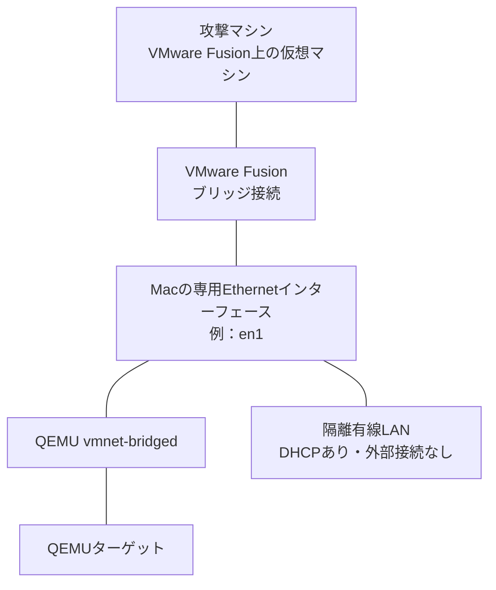

# macOSでマシンを起動する

macOS上のQEMUでマシンを起動し、攻撃マシンから接続するための手順です。NATやポート転送は使いません。QEMUの `vmnet-bridged` と攻撃マシンを同じ隔離有線LANへ接続します。

このREADMEでは、攻撃マシンをVMware Fusion上で起動することを想定します。VirtualBox上で攻撃マシンを動かす場合は、「[その他の接続構成](#その他の接続構成)」を参照してください。

## 注意事項

このマシンには脆弱なサービスが含まれています。企業LAN、公衆Wi-Fi、インターネットへ接続しないでください。

ブリッジ接続では、指定した物理インターフェースの接続先へマシンが公開されます。通常利用中のLANやWi-Fiは指定せず、外部ネットワークへ接続されていない専用の有線LANを使用してください。Macのインターネット共有も、このLANに対して有効にしないでください。

## 必要なもの

- HomebrewとHomebrew版QEMU
- VMware Fusion上で動作する攻撃マシン
- DHCPが動作する隔離有線LANと、それに接続するEthernetアダプタ
- 4 GiB以上の空きメモリ
- ダウンロードした `<ARTIFACT_ID>.zip`

配布物を展開すると、次のファイルが同じディレクトリに配置されます。

- `image.qcow2`
- `start-macos.sh`

## ネットワーク構成



攻撃マシンとQEMUターゲットは同じL2セグメントへ接続されます。IPアドレスは、隔離有線LANで動作するDHCPから取得します。

Mac版の起動スクリプトは、物理インターフェースへ接続する `vmnet-bridged` を使います。Windows版のHost-OnlyネットワークとTAPアダプタを使う構成とは異なります。[QEMUのネットワーク設定](https://www.qemu.org/docs/master/interop/qemu-qmp-ref.html#object-netdevvmnetbridgedoptions)も参照してください。

## セットアップ

### 1. 配布物を展開する

空の専用ディレクトリでターミナルを開き、ダウンロードしたZIPファイルを展開します。

```sh
unzip <ARTIFACT_ID>.zip
cd slsg-machine
```

### 2. QEMUを準備する

HomebrewでQEMUをインストールします。Homebrewが未導入の場合は、先に[公式サイト](https://brew.sh/ja/)の手順に従ってインストールしてください。

```sh
brew install qemu
```

ターミナルで次のコマンドを実行し、QEMUを起動できることを確認します。

```sh
qemu-system-x86_64 --version
```

Apple Siliconではx86_64ゲストをハードウェア仮想化できないため、起動スクリプトはQEMU TCGでCPUをエミュレーションします。Intel MacではHVFを使用します。

### 3. 隔離有線LANのインターフェースを確認する

専用のEthernetアダプタを隔離有線LANへ接続し、macOSのネットワークインターフェースを確認します。

```sh
networksetup -listallhardwareports
```

出力例：

```text
Hardware Port: USB 10/100/1000 LAN
Device: en1
Ethernet Address: xx:xx:xx:xx:xx:xx
```

この場合、`<BRIDGE_INTERFACE>` には `Device` に表示された `en1` を指定します。インターフェース名は環境によって異なるため、出力例の値をそのまま使用しないでください。

以降のプレースホルダは、実際の値へ置き換えてください。

| プレースホルダ | 説明 | 例 |
| --- | --- | --- |
| `<ARTIFACT_ID>` | ダウンロードしたZIPファイルの拡張子を除いた名前 | ファイル名が `abc123.zip` なら `abc123` |
| `<BRIDGE_INTERFACE>` | 隔離有線LANへ接続したMacのEthernetインターフェース名 | `en1` |
| `<MACHINE_DIRECTORY>` | `image.qcow2` と `start-macos.sh` があるディレクトリのパス | `/Users/akira/labs/slsg-machine` |
| `<TARGET_IP>` | 起動後にQEMUのコンソールへ表示されるターゲットのIPv4アドレス | `192.168.50.10` |

### 4. 攻撃マシンを同じ隔離有線LANへ接続する

VMware Fusionで攻撃マシンの仮想マシン設定を開き、ネットワークアダプタをブリッジ接続へ変更します。手順3で確認したEthernetアダプタを選択してください。

「自動検出」は使わず、対象アダプタを明示します。自動検出では、通常利用中のLANやWi-Fiなど、別の接続先が選ばれるおそれがあります。[VMware Fusionのブリッジ接続設定](https://knowledge.broadcom.com/external/article?legacyId=1001875)も参照してください。

隔離有線LANでDHCPが有効になっていることも確認します。スイッチやEthernetアダプタだけでは、IPアドレスは配布されません。

## マシンを起動する

ターミナルで、`start-macos.sh` があるディレクトリへ移動し、実行権限を付与します。

```sh
cd "<MACHINE_DIRECTORY>"
chmod +x start-macos.sh
```

確認したインターフェースを指定して、マシンを起動します。

```sh
./start-macos.sh --bridge <BRIDGE_INTERFACE>
```

実行例：

```sh
./start-macos.sh --bridge en1
```

誤って通常利用中のLANへ接続しないよう、`--bridge` は必須引数になっています。

起動すると、ログインプロンプトの前にターゲットのIPv4アドレスが表示されます。このアドレスは、次の手順で `<TARGET_IP>` として使用します。

## 攻撃マシンから接続を確認する

ここからは、攻撃マシンで操作します。以下のコマンドはKali Linuxでの実行例です。

QEMUのコンソールに表示されたIPアドレスを指定し、ターゲットへpingを実行します。

```sh
ping <TARGET_IP>
```

応答が返れば接続できています。pingを終了するには、`Ctrl + C` を押します。

必要に応じて、ターゲットを探索します。

```sh
sudo arp-scan --localnet
sudo nmap -Pn -sS -sV -p- <TARGET_IP>
sudo nmap -Pn -sU --top-ports 100 <TARGET_IP>
```

## マシンを終了する

QEMUのコンソールから、ユーザー `provisioner` でログインします。パスワードは、マシンのダウンロード画面に表示された値です。

ゲスト内で次のコマンドを実行し、マシンを終了します。

```sh
sudo poweroff
```

## その他の接続構成

### VirtualBox上の攻撃マシン

攻撃マシンの仮想マシン設定で「ネットワーク」を開き、ブリッジ接続を選択します。接続先には、`start-macos.sh` の `--bridge` と同じEthernetインターフェースを指定してください。

## トラブルシューティング

### 起動スクリプトを実行できない

`start-macos.sh` があるディレクトリで、`chmod +x start-macos.sh` を実行したことを確認してください。

### vmnetの権限エラーで起動できない

QEMUのパスを維持して、管理者権限で実行します。

```sh
sudo env PATH="$PATH" ./start-macos.sh --bridge <BRIDGE_INTERFACE>
```

### Apple Siliconで起動に時間がかかる

x86_64のCPUをTCGでエミュレーションするため、Intel MacのHVFを使う場合より遅くなります。起動スクリプトでの方式の切り替えは不要です。

### ターゲットIPが表示されない、またはpingに応答しない

次の項目を確認してください。

- QEMU上でマシンが起動している
- `--bridge` に指定したインターフェースが隔離有線LANへ接続されている
- 攻撃マシンが同じEthernetインターフェースへブリッジ接続されている
- 隔離有線LANでDHCPが有効になっている
- `<TARGET_IP>` にQEMUのコンソールへ表示されたIPアドレスを指定している
- 攻撃マシンとターゲットが同じサブネットのIPアドレスを取得している

Wi-Fi経由では、アクセスポイントのクライアント分離や無線NICのブリッジ制限で通信できない場合があります。この手順では専用の有線Ethernetアダプタを使用してください。
