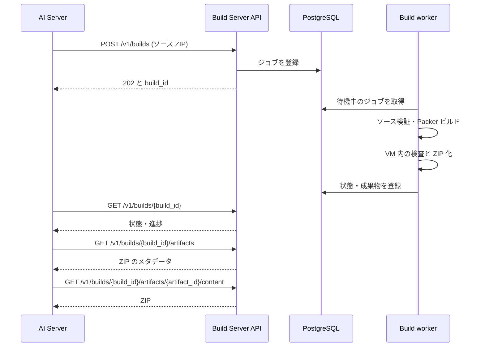
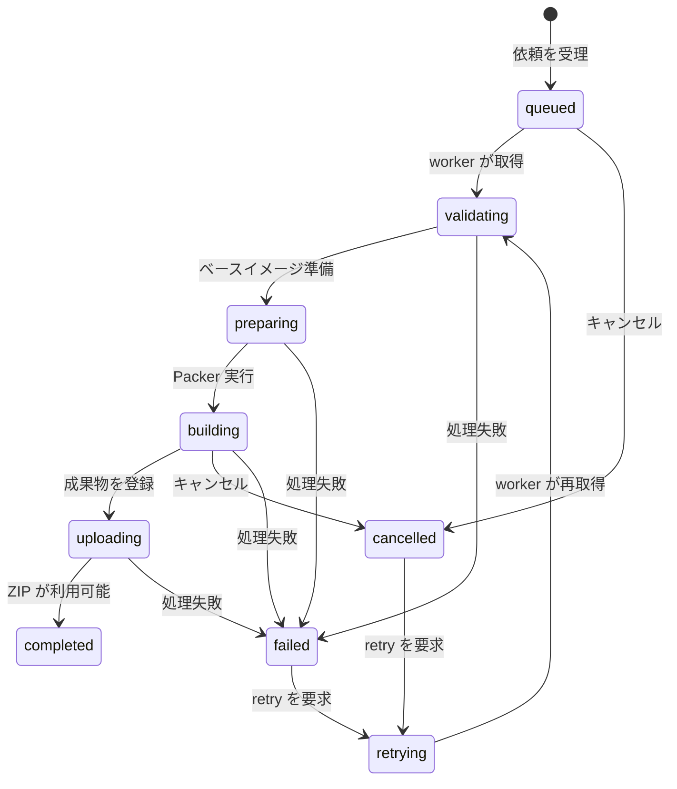

# Build Server 仕様

Build Server は、AI Server が作成したシナリオソースの ZIP を受け取り、学習用 VM を非同期でビルドします。ビルドの状態、イベント、成果物はビルド ID で参照できます。各エンドポイントのフィールド定義は [OpenAPI](../api/openapi.yaml) にあります。

## ビルドの流れ

API は依頼を PostgreSQL に記録してすぐ応答します。worker がジョブを取得し、対象 OS のベースイメージにシナリオを適用します。`contents/build.sh` の後にフラグ設置処理と `contents/scripts/verify.sh` を実行し、検査を通過した成果物を公開します。

## 認証と呼び出し元

`/v1` 以下の全操作には `Authorization: Bearer <INTERNAL_API_TOKEN>` が必要です。欠落または不一致の場合は `401` を返します。Build Server は内部サービスで、通常は AI Server だけが呼び出します。AI Server の `BUILD_SERVER_TOKEN` と Build Server の `INTERNAL_API_TOKEN` は同じ値にします。

`POST /v1/builds` では、認証に加えて `X-Authenticated-User-ID` と `Idempotency-Key` が必須です。前者は依頼元のユーザー ID、後者は同じ依頼の重複登録を避けるためのキーです。ヘルスチェックの `/health/live` と `/health/ready` にはトークンは不要です。

## ビルドを依頼する

`POST /v1/builds` は `multipart/form-data` で次の値を受け取ります。

| 項目 | 内容 |
| --- | --- |
| `scenario_id` | シナリオ ID。英数字で始まり、以降に英数字、`.`、`_`、`-` を使える。最大 128 文字。 |
| `scenario_version_id` | バージョン ID。形式は `scenario_id` と同じ。 |
| `source` | シナリオソースの ZIP。圧縮後 64 MiB 以下。 |
| `X-Authenticated-User-ID` | 依頼元ユーザー。空文字は不可。 |
| `Idempotency-Key` | 冪等性キー。空文字は不可、最大 200 文字。 |

ZIP の展開後サイズは 512 MiB 以下、1 ファイルは 100 MiB 以下、項目数は 10,000 以下です。絶対パス、親ディレクトリへの移動、シンボリックリンク、通常のファイル・ディレクトリ以外の項目は拒否します。ソースには `contents/README.md`、`contents/scenario_manifest.json`、`contents/build.sh`、`contents/scripts/provision.sh`、`contents/scripts/install-flags.sh`、`contents/scripts/verify.sh` が必要です。

新規依頼には `202 Accepted` と `Location: /v1/builds/{build_id}`、既存と同じユーザー・キーの再送には `200 OK` を返します。同じキーを異なるシナリオ ID またはバージョン ID に使うと `409 Conflict` です。ZIP が不正な場合は `400 Bad Request` です。

## 状態を追跡する

`GET /v1/builds/{build_id}` は現在の状態を返します。`status` は上図のいずれか、`progress` は 0～100 です。`queued_at`、`started_at`、`completed_at` は該当する段階で設定されます。失敗時には `error_message` が入ります。`cancel_requested=true` はキャンセル要求が受理されたことを示し、処理中の worker が停止するまでは `status` がすぐに `cancelled` にならない場合があります。

正常にビルドを終えた場合、`machine_password` には VM の `provisioner` ユーザー用に生成した 32 文字のランダムなパスワードが入ります。これは秘密情報です。AI Server は `machine_access` としてセッションへ保存します。

`GET /v1/builds/{build_id}/events?after=<event_id>` は `{"items":[...]}` を返します。イベントは `build_event_id` の昇順で最大 500 件です。`after` は 0 以上の整数で、省略時は 0 です。各イベントには `event_type`、`message`、`progress`、`created_at` が含まれます。継続取得では最後の `build_event_id` を次回の `after` に指定します。この API は SSE ではなく通常の JSON 応答です。

## キャンセルと再試行

`POST /v1/builds/{build_id}/cancel` はキャンセルを要求し、成功時はボディなしの `202` を返します。待機中なら直ちに `cancelled`、処理中なら `cancel_requested=true` となって worker の停止を待ちます。`completed`、`failed`、`cancelled` からはキャンセルできず `409` です。

`POST /v1/builds/{build_id}/retry` は `failed` または `cancelled` のビルドを同じ ID で再実行します。成功時はボディなしの `202` を返し、状態は `retrying` になります。ほかの状態では `409` です。再試行時は進捗、エラー、マシンパスワード、旧成果物の登録をリセットします。AI Server が自動修復でソースを差し替える場合は、この API ではなく新しいビルドを依頼します。

## ログと成果物を取得する

`GET /v1/builds/{build_id}/logs/packer` は Packer ログの末尾を `text/plain` で返します。ログがまだなければ `404` です。

`GET /v1/builds/{build_id}/artifacts` は `{"items":[...]}` を返します。成果物には `artifact_id`、`artifact_type`、`file_name`、`file_size`、`checksum`、`created_at` が含まれます。完成後に公開される配布物の種類は `zip` です。

`GET /v1/builds/{build_id}/artifacts/{artifact_id}/content` は `application/zip` でファイルを返します。HTTP の `Range` による部分取得にも対応します。成果物の登録だけが残り、ファイルが見つからない場合は `404`、旧形式から ZIP への移行中は `409` です。

配布 ZIP の最上位ディレクトリは `slsg-machine/` です。中には `image.qcow2`、Windows 用の `Start-Windows.ps1` と `README-Windows.pdf`、macOS 用の `start-macos.sh` と `README-macOS.pdf` が入ります。VM のコンソールには、DHCP で取得した IPv4 アドレスがログイン前に表示されます。

worker の起動時には、登録済みの旧 `tar.zst` 成果物と、内容が旧形式の ZIP をこの 5 ファイル構成に更新します。成果物 ID は維持し、ファイルサイズと SHA-256 チェックサムを更新します。旧 `tar.zst` ファイルは、メタデータの更新後に削除します。

利用者はこの内部 API を直接呼びません。AI Server が一時的な署名付き URL を発行し、ZIP を中継します。

## ヘルスチェックとエラー

`GET /health/live` はプロセスの生存を確認し、正常時に `{"status":"ok"}` を返します。`GET /health/ready` は PostgreSQL 接続も確認し、接続できなければ `503` を返します。

エラー本文は `application/problem+json` です。`type`、`title`、`status`、`detail` を含みます。

| HTTP 状態 | 主な発生条件 |
| --- | --- |
| `400` | 必須ヘッダー・フォーム項目の欠落、ID や ZIP の形式違反、無効な `after`。 |
| `401` | Bearer トークンの欠落または不一致。 |
| `404` | 指定したビルド、ログ、成果物が存在しない。 |
| `409` | 冪等性キーの競合、現在の状態では無効なキャンセル・再試行、ZIP 移行中。 |
| `503` | 認証設定がない、または readiness 確認時にデータベースが使えない。 |
