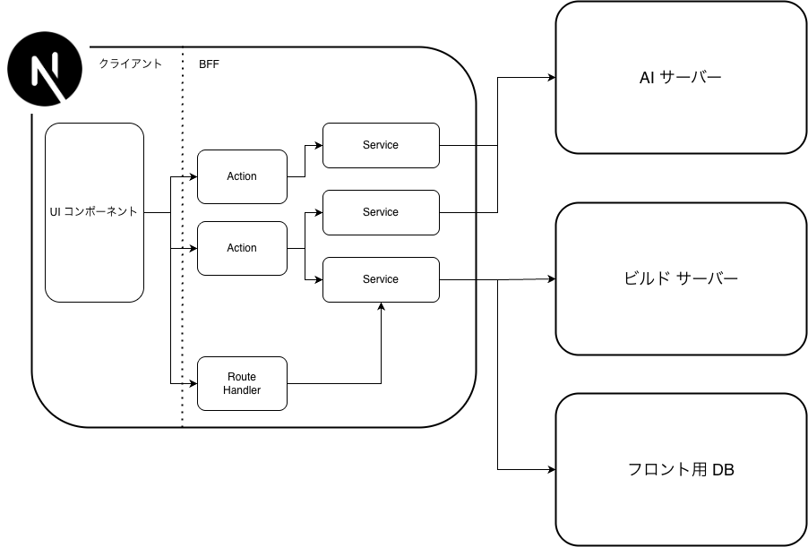

# フロントエンド設計

## 1. 本ドキュメントの目的

- 本ドキュメントは、SLSG のフロントエンドアプリケーションの設計及び責務の方針を示す
- 対象：フロントエンドの構成・フロントエンドの責務・フロントエンドに持たせる機能
- 対象外：実装の詳細・認証認可・フロントエンドDB定義
- サービスのデータ所有とシステム全体の基本方針は [システム仕様書](./spec.md) に従う

## 3. 構成



図の破線より左側が利用者のブラウザで動くクライアント、右側が Next.js サーバー上で動く BFF である。UI コンポーネントはクライアントから Server Action または Route Handler を呼び出す。BFF 内では、それらの入口が Service を呼び出し、Service が AI サーバー、ビルドサーバー、フロント用 DB と通信する。

Server Action、Route Handler、Service はいずれも Next.js サーバー上で動作する。Service は BFF 内部の処理であり、ブラウザから直接呼び出さない。

---

## 4. 各構成要素の役割

### 4.1 UI コンポーネント

UI コンポーネントは、利用者に見せる画面と操作の責務を持つ。UI コンポーネントは各外部サーバーへ直接通信しない。これにより、UI から内部ネットワークや下流サービスの仕様が見えなくなる。

- 画面の入力欄、ボタン、一覧の表示などを行う
- マシンの作成依頼やフラグ提出など、利用者の操作を BFF へ渡す
- ビルドの進捗などの情報を BFF から取得する

### 4.2 Server Action

- Server Action は、React のフォーム送信やボタン操作に対応する、Next.js サーバー側の関数を指す
- 利用者の操作ごとに関数を一つ割り当てられるため、画面実装と処理の対応が分かりやすい
- Server Action は、外部サーバーとの通信方法・接続先・レスポンスを知るべきではなく、これらは Service に隠蔽する

```text
「演習環境を作成」ボタン
   ↓
createLabAction(入力値)
   ↓
演習環境生成 Service
```

Server Action の責務は次のとおりである。
- UI コンポーネントから受け取った入力を検証する
- ユーザーの認証・認可を行う
- 対応する Service を呼び出す
- Service の結果を UI 向けに返す

### 4.3 Route Handler

Route Handler は、Next.js 内で HTTP リクエストを直接受け取り、HTTP レスポンスを返す機能である。通常の更新操作には使わず、HTTP の性質を利用する必要がある場合だけ採用する。

採用する用途は次のとおりである。

| 用途 | Server Action ではなく Route Handler を使う理由 |
|---|---|
| ビルド進捗のポーリング | ブラウザが繰り返し `GET` で状態を取得するため。進捗取得が HTTP の読み取り操作であることを明確にできる |
| 仮想マシン成果物のダウンロード | 大容量ファイルをストリームで返し、`Range` や `Content-Disposition` などの HTTP ヘッダーを扱うため |

Route Handler 自身も、下流サービスの呼び出しは Service に委譲する。

### 4.4 Service

Service は、Next.js サーバーの内部に置くサーバー専用の処理である。

Service の責務は次のとおりである。

- AI サーバー、ビルドサーバー、フロント用 DB との通信を一箇所にまとめる
- 下流サービスごとのデータ形式を、UI で使いやすい形へ変換する
- 複数の下流サービスから得た情報を必要に応じてまとめる
