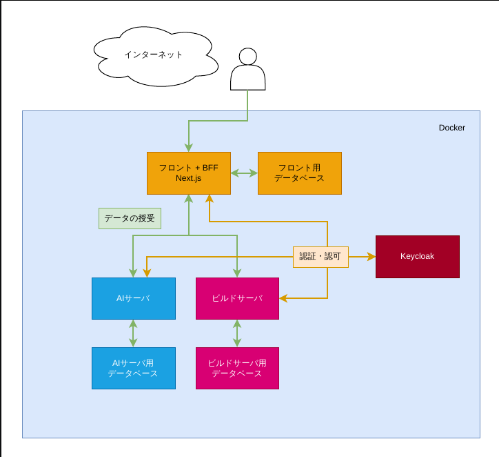

# 本システムの仕様書

## 1. 仕様書の目的

本仕様書は、本システムの設計、開発および運用に関する基本仕様を明確にし、関係者間で共通認識を形成することを目的とします。

本システムは、生成AIを用いてセキュリティ学習用シナリオおよびPackerビルド用コードを生成し、そのコードに基づいて仮想マシンイメージを構築するWebシステムです。

---

## 2. システム概要

本システムは、以下の主要コンポーネントで構成されます。

1. フロントエンド
2. BFF
3. AI・シナリオサービス
4. ビルドサービス
5. ビルドワーカー
6. 各サービス用データベース
7. 成果物保存用ファイル領域
8. ジョブキュー

システム全体の概略構成を以下に示します。

```text
ユーザー
   │
   ▼
フロントエンド
   │
   ▼
BFF
   │
   ├── AI・シナリオサービス
   │       └── AIサービス用データベース
   │
   └── ビルドサービス
           ├── ビルドサービス用データベース
           ├── ジョブキュー
           └── ビルドワーカー
                   ├── Packer
                   └── 成果物保存用ファイル領域
```



各サービスは、原則として自身が管理するデータベースのみを直接操作します。

他サービスが所有するデータを参照する場合は、対象サービスが提供するAPIまたはイベントを通じて取得します。

サービス間のデータベースを直接参照したり、サービスをまたいだ外部キー制約を設定したりしません。

---

## 3. 主要コンポーネント

### 3.1 フロントエンド

フロントエンドは、ユーザーにWebブラウザ上の操作画面を提供するコンポーネントです。

Next.jsを使用して実装します。

主な責務は以下のとおりです。

* ユーザーインターフェースの表示
* ユーザーによるシナリオ作成条件の入力
* シナリオ一覧および詳細情報の表示
* AIによる生成結果の表示
* ビルド要求の送信
* ビルド進捗状況の表示
* ビルド結果および成果物情報の表示
* ユーザー設定画面の提供

フロントエンドは、AI・シナリオサービスやビルドサービスを直接呼び出しません。

すべてのバックエンド処理は、原則としてBFFを経由して実行します。

---

### 3.2 BFF

BFFは、フロントエンドとバックエンドサービスの間に配置される、フロントエンド専用のAPI層です。

Next.jsのRoute HandlersまたはAPI Routesを使用して実装します。

主な責務は以下のとおりです。

* フロントエンド向けAPIの提供
* ユーザー認証および認可
* セッション管理
* リクエストの入力検証
* AI・シナリオサービスのAPI呼び出し
* ビルドサービスのAPI呼び出し
* 複数のバックエンドAPIから取得した情報の集約
* フロントエンド向けのレスポンス形式への変換
* エラーレスポンス形式の統一
* CSRF対策
* 必要に応じたレート制限
* 一時的なキャッシュの管理

BFFは、シナリオ情報やビルド情報などの業務データの正本を保持しません。

シナリオに関する正本はAI・シナリオサービスが管理し、ビルドに関する正本はビルドサービスが管理します。

BFFがデータストアを使用する場合、保存対象は以下のようなBFF固有のデータに限定します。

* セッション情報
* ユーザーごとの画面表示設定
* 一時的なキャッシュ
* 通知の既読状態
* 一時的な認証状態

---

### 3.3 AI・シナリオサービス

AI・シナリオサービスは、シナリオの管理および生成AIとの通信を担当するバックエンドサービスです。

Pythonを使用して実装し、生成AIとの連携にはLangChainを使用します。

主な責務は以下のとおりです。

* シナリオの作成
* シナリオの編集
* シナリオの削除
* シナリオの一覧取得
* シナリオの詳細取得
* シナリオのバージョン管理
* 生成AIを利用したシナリオ生成
* シナリオに基づくPackerビルド用コードの生成
* 生成結果の検証
* 生成履歴の管理
* 生成処理の状態管理
* 生成したコードのメタデータ管理
* ビルドサービスへ渡す入力データの作成

AI・シナリオサービスは、シナリオに関するデータの正本を所有します。

BFFやビルドサービスは、AI・シナリオサービス用データベースを直接参照しません。

---

### 3.4 ビルドサービス

ビルドサービスは、Packerビルド要求の受付、スケジューリングおよびビルド状態の管理を担当するサービスです。

Goを使用して実装します。

主な責務は以下のとおりです。

* ビルド要求の受付
* ビルド要求の妥当性確認
* ビルドジョブの登録
* ビルドジョブのスケジューリング
* ジョブキューへのビルド要求の登録
* ビルドジョブの状態管理
* ビルド進捗状況の管理
* ビルド結果の管理
* ビルドログ情報の管理
* 成果物情報の管理
* ビルドのキャンセル受付
* ビルドの再実行受付
* フロントエンドへの進捗情報の提供
* ビルドワーカーの稼働状態管理

ビルドサービス自身は、原則としてPackerのビルド処理を直接実行しません。

実際のPacker実行は、ジョブキューを経由してビルドワーカーが担当します。

---

### 3.5 ビルドワーカー

ビルドワーカーは、ビルドサービスによって登録されたジョブを取得し、Packerを実行するコンポーネントです。

ビルドワーカーはGoまたはシェルスクリプト等を用いて制御します。

主な責務は以下のとおりです。

* ジョブキューからのビルドジョブ取得
* ビルド対象コードの取得
* ビルド用作業ディレクトリの作成
* Packer設定ファイルの検証
* Packer CLIの実行
* ビルドログの収集
* ビルド進捗状況の通知
* ビルド結果の通知
* 生成された仮想マシンイメージの保存
* 成果物のチェックサム計算
* 一時ファイルの削除
* ビルド完了後の実行環境の破棄

生成AIが生成したコードを実行するため、ビルドワーカーは他のAPIサーバから分離し、制限された環境で動作させます。

ビルドジョブごとに、可能な限り独立した作業環境を使用します。

---

## 4. 補助コンポーネント

### 4.1 BFF用データストア

BFF用データストアは、BFF固有の一時的またはユーザーインターフェース向けデータを保存します。

主な保存対象は以下のとおりです。

* セッション情報
* ユーザーごとの画面表示設定
* 一時キャッシュ
* 通知の既読状態
* CSRFトークンに関する情報
* 一時的な認証情報

BFF用データストアには、シナリオやビルド結果の正本を保存しません。

システム規模や認証方式によっては、BFF専用の永続データベースを設けず、Redisや暗号化Cookieなどを利用する構成も許容します。

---

### 4.2 AIサービス用データベース

AIサービス用データベースは、AI・シナリオサービスが使用する専用データベースです。

主な保存対象は以下のとおりです。

* シナリオ
* シナリオのバージョン
* シナリオ生成条件
* 生成AIへの入力内容
* 生成AIからの出力内容
* シナリオ生成履歴
* ソースコード生成履歴
* 生成処理の状態
* 生成エラー情報
* 生成コードの保存先
* 生成コードのチェックサム
* 作成者および更新者の識別子
* 作成日時および更新日時

想定する主要なデータ構造を以下に示します。

```text
Scenario
├── scenario_id
├── owner_user_id
├── title
├── description
├── difficulty
├── status
├── current_version
├── created_at
└── updated_at
```

```text
ScenarioVersion
├── scenario_version_id
├── scenario_id
├── version
├── scenario_definition
├── target_os
├── attack_graph
├── generated_code_path
├── generated_code_checksum
├── created_by
└── created_at
```

AIサービス用データベースは、AI・シナリオサービスのみが直接操作します。
生成処理の進捗とエラーはセッションに保持し、独立した生成ジョブテーブルは設けません。

---

### 4.3 ビルドサービス用データベース

ビルドサービス用データベースは、ビルドサービスが使用する専用データベースです。

主な保存対象は以下のとおりです。

* ビルドジョブ
* ビルド状態
* ビルド進捗率
* ビルドイベント
* ビルド開始日時
* ビルド完了日時
* ビルドエラー情報
* ビルドログの保存先
* 成果物の保存先
* 成果物の種類
* 成果物のファイルサイズ
* 成果物のチェックサム
* ビルドを実行したワーカーの情報

想定する主要なデータ構造を以下に示します。

```text
BuildJob
├── build_id
├── scenario_id
├── scenario_version_id
├── requested_by
├── status
├── progress
├── worker_id
├── queued_at
├── started_at
├── completed_at
└── error_message
```

```text
BuildEvent
├── build_event_id
├── build_id
├── event_type
├── message
├── progress
└── created_at
```

```text
BuildArtifact
├── artifact_id
├── build_id
├── artifact_type
├── file_path
├── file_name
├── file_size
├── checksum
└── created_at
```

`scenario_id`および`scenario_version_id`は、AI・シナリオサービスが管理するデータを識別するための外部識別子として保存します。

ただし、AIサービス用データベースに対するデータベースレベルの外部キー制約は設定しません。

---

### 4.4 ジョブキュー

ジョブキューは、ビルドサービスが受け付けたビルド要求をビルドワーカーへ非同期に引き渡すために使用します。

主な用途は以下のとおりです。

* ビルド要求の待機
* ビルド要求の順序制御
* 同時実行数の制御
* ビルドワーカーへのジョブ割り当て
* 一時的な障害発生時の再試行
* 処理中ジョブの管理
* 失敗ジョブの管理

ジョブキューとして、以下のいずれかを使用します。

* Redisを使用したジョブキュー
* Redis Streams
* RabbitMQ
* NATS JetStream
* PostgreSQLのジョブテーブル

初期構成では、システム規模や運用負荷を考慮し、RedisまたはPostgreSQLを利用した構成を想定します。

ビルド処理は、HTTPリクエスト内で同期的に完了させません。

ビルド要求を受け付けた時点でビルドIDを返し、実際の処理は非同期で実行します。

---

### 4.5 成果物保存用ファイル領域

本システムでは、オブジェクトストレージを使用せず、サーバ上のファイルシステムに成果物を保存します。

保存対象は以下のとおりです。

* 生成されたPackerテンプレート
* 生成されたシェルスクリプト
* 生成されたAnsible Playbook
* その他の生成ソースコード
* Packerのビルドログ
* ビルド時の標準出力および標準エラー出力
* qcow2ファイル
* vmdkファイル
* ISOファイル
* 圧縮済み仮想マシンイメージ
* ビルド時に生成された補助ファイル

データベースにはファイル本体を保存せず、以下のメタデータのみを保存します。

* ファイルパス
* ファイル名
* ファイル種別
* ファイルサイズ
* チェックサム
* 作成日時
* 関連するシナリオID
* 関連するビルドID

成果物保存用ディレクトリの例を以下に示します。

```text
/var/lib/security-scenario-generator/
├── scenarios/
│   └── {scenario_id}/
│       └── {scenario_version_id}/
│           ├── source/
│           │   ├── template.pkr.hcl
│           │   ├── scripts/
│           │   └── ansible/
│           └── metadata/
│
├── builds/
│   └── {build_id}/
│       ├── workspace/
│       ├── logs/
│       │   ├── packer.log
│       │   ├── stdout.log
│       │   └── stderr.log
│       └── artifacts/
│           ├── image.qcow2
│           └── checksum.sha256
│
└── temporary/
```

成果物のファイルパスには、ユーザーが指定した文字列をそのまま使用しません。

システムが生成したUUIDなどの識別子を使用し、パストラバーサルを防止します。

---

## 5. データの所有関係

各データの所有サービスを以下のとおり定義します。

| データ          | 所有サービス      |
| ------------ | ----------- |
| セッション情報      | BFF         |
| ユーザーの画面表示設定  | BFF         |
| シナリオ情報       | AI・シナリオサービス |
| シナリオのバージョン情報 | AI・シナリオサービス |
| マシン接続情報      | AI・シナリオサービス |
| 生成コードのメタデータ  | AI・シナリオサービス |
| ビルドジョブ       | ビルドサービス     |
| ビルド進捗        | ビルドサービス     |
| ビルド結果        | ビルドサービス     |
| ビルドイベント      | ビルドサービス     |
| 成果物のメタデータ    | ビルドサービス     |
| 生成コード本体      | ファイル領域      |
| ビルドログ本体      | ファイル領域      |
| 仮想マシンイメージ    | ファイル領域      |

同じ業務データを複数のサービスで正本として管理しません。

他サービスのデータを保持する必要がある場合は、外部識別子または再生成可能な読み取り専用データとして扱います。

---

## 6. シナリオ生成処理

シナリオ生成処理の基本フローを以下に示します。

```text
1. ユーザーが生成条件を入力する
2. フロントエンドがBFFへ生成要求を送信する
3. BFFがユーザー認証および入力検証を行う
4. BFFがAI・シナリオサービスへ生成要求を送信する
5. AI・シナリオサービスがセッションの生成状態を更新する
6. AI・シナリオサービスが生成AIを呼び出す
7. 生成されたシナリオを検証する
8. シナリオをAIサービス用データベースへ保存する
9. 生成結果をBFFへ返す
10. BFFがフロントエンド向けに変換して返す
```

生成処理に時間がかかる場合は、生成処理についても非同期ジョブ化することを許容します。

---

## 7. ビルド処理

ビルド処理の基本フローを以下に示します。

```text
1. ユーザーがビルドを要求する
2. フロントエンドがBFFへビルド要求を送信する
3. BFFがユーザー認証および認可を行う
4. BFFがビルドサービスへビルド要求を送信する
5. ビルドサービスがシナリオIDとバージョンIDを検証する
6. ビルドサービスがビルドジョブを登録する
7. ビルドサービスがジョブキューへジョブを登録する
8. ビルドサービスがビルドIDをBFFへ返す
9. ビルドワーカーがジョブを取得する
10. ビルドワーカーが作業ディレクトリを作成する
11. ビルドワーカーが生成コードを作業ディレクトリへ配置する
12. ビルドワーカーがPacker設定を検証する
13. ビルドワーカーがPackerを実行する
14. ビルドワーカーが進捗をビルドサービスへ通知する
15. ビルドワーカーが成果物をファイル領域へ保存する
16. ビルドワーカーが成果物のチェックサムを計算する
17. ビルドサービスがビルド結果をデータベースへ保存する
18. フロントエンドがビルド結果を取得する
```

ビルドサービスへのHTTPリクエストは、Packerの処理完了を待機しません。

---

## 8. ビルド進捗の通知

ビルド進捗をフロントエンドへ通知する方式として、以下のいずれかを使用します。

### 8.1 ポーリング方式

フロントエンドが一定間隔でBFFへビルド状況を問い合わせます。

```http
GET /api/builds/{build_id}
```

BFFはビルドサービスから最新状態を取得して返します。

初期実装では、構成が単純で障害時の復旧も容易なため、ポーリング方式を基本とします。

---

### 8.2 Server-Sent Events方式

サーバから継続的に進捗を送信する必要がある場合は、Server-Sent Eventsを使用します。

```http
GET /api/builds/{build_id}/events
```

SSEを採用する場合も、ビルド状態の正本はビルドサービス用データベースに保存します。

接続が切断された場合は、フロントエンドが最新状態を再取得できるようにします。

---

## 9. 認証および認可

ユーザー認証はBFFを中心として実施します。

認証方式として、OpenID ConnectまたはOAuth 2.0に対応した認証基盤を使用することを想定します。

利用候補には以下があります。

* Keycloak
* Auth0
* Amazon Cognito
* 独自の認証サービス

BFFは、認証済みユーザーの識別子および権限情報を確認した上で、バックエンドサービスを呼び出します。

内部サービスは、単純なHTTPヘッダーのみを無条件で信頼しません。

以下のような値だけを認証根拠として使用しません。

```http
X-User-Id: user123
```

内部通信では、以下のいずれかの方式を使用します。

1. ユーザーのアクセストークンをバックエンドサービスへ伝播する
2. BFFがサービス用トークンを使用し、署名されたユーザー情報を渡す
3. BFFが短時間のみ有効な内部JWTを発行する

AI・シナリオサービスおよびビルドサービスは、受け取ったトークンの以下の項目を検証します。

* 署名
* 発行者
* 有効期限
* 対象サービス
* スコープ
* ロール
* ユーザー識別子

---

## 10. サービス間通信

サービス間通信は、原則としてHTTPSを使用します。

Dockerの内部ネットワーク上に配置されている場合でも、内部ネットワークだけを認証の根拠としません。

各サービスは以下を実施します。

* 呼び出し元サービスの認証
* トークンの検証
* リクエストの入力検証
* ユーザーまたはサービスの権限確認
* 操作ログの記録

必要に応じて、サービス間通信に相互TLSを導入します。

---

## 11. ビルド環境の隔離

生成AIが生成したコードには、誤った処理や意図しないコマンドが含まれる可能性があります。

そのため、ビルドワーカーは制限された環境でPackerを実行します。

最低限、以下の対策を実施します。

* APIサーバとビルド実行環境を分離する
* ビルドごとに作業ディレクトリを分離する
* ビルド完了後に一時ファイルを削除する
* ホストのDockerソケットを直接公開しない
* 必要のないデバイスをビルド環境へ渡さない
* ホストのルートファイルシステムをマウントしない
* 秘密情報をビルド環境へ渡さない
* 実行ユーザーを非rootユーザーとする
* CPU使用量を制限する
* メモリ使用量を制限する
* ディスク使用量を制限する
* ビルド実行時間を制限する
* プロセス数を制限する
* 外部ネットワークアクセスを制限する
* 使用可能なPackerプラグインを制限する
* 生成コードに対する静的検査を実施する
* 実行コマンドを監査ログへ記録する

可能な場合は、ビルドごとに一時的な仮想マシンまたはコンテナを作成し、処理完了後に破棄します。

---

## 12. ファイル領域のセキュリティ

成果物保存用ファイル領域には、以下のセキュリティ対策を実施します。

* Webサーバから直接公開しない
* BFFまたはビルドサービスを経由してダウンロードさせる
* ダウンロード時に認証および認可を行う
* ユーザー入力をファイルパスへ直接使用しない
* ファイル名をシステム側で正規化する
* パストラバーサルを防止する
* シンボリックリンクを利用した領域外アクセスを防止する
* ファイルごとに所有者とアクセス権を設定する
* 実行権限が不要なファイルには実行権限を付与しない
* 成果物のチェックサムを保存する
* 定期的に不要ファイルを削除する
* ファイル容量の上限を設定する
* ディスク空き容量を監視する

成果物をユーザーへ提供する場合は、ファイルの実体パスを直接返さず、成果物IDを使用します。

```http
GET /api/builds/{build_id}/artifacts/{artifact_id}
```

---

## 13. バックアップ

オブジェクトストレージを使用せず、ローカルまたは共有ファイルシステムへ成果物を保存するため、データベースとファイル領域の両方をバックアップ対象とします。

バックアップ対象は以下のとおりです。

* AIサービス用データベース
* ビルドサービス用データベース
* BFF用データストア
* 生成コード保存領域
* ビルドログ保存領域
* 仮想マシンイメージ保存領域
* サービス設定ファイル
* 暗号鍵および証明書

データベースとファイル領域の整合性を保つため、バックアップ時刻や世代を対応付けて管理します。

---

## 14. 可用性に関する注意事項

成果物を単一サーバのローカルファイルシステムへ保存する場合、そのサーバが単一障害点となります。

サーバ障害やディスク障害が発生すると、成果物へアクセスできなくなる可能性があります。

初期構成ではローカルファイルシステムを使用しますが、必要に応じて以下の構成へ移行できるよう、ファイル操作を抽象化します。

* NFSなどの共有ファイルシステム
* 分散ファイルシステム
* S3互換オブジェクトストレージ
* クラウドストレージ

アプリケーション内では、ファイルパスを直接組み立てる処理を各所に分散させず、専用のストレージ操作モジュールを経由して保存および取得を行います。

---

## 15. ログおよび監査

各サービスは、以下のログを記録します。

* リクエストログ
* エラーログ
* 認証ログ
* 認可失敗ログ
* AI生成処理ログ
* ビルド要求ログ
* ビルド実行ログ
* Packerの標準出力
* Packerの標準エラー出力
* 成果物ダウンロードログ
* 管理操作ログ

ログには、可能な限り以下の識別子を含めます。

* request_id
* trace_id
* user_id
* scenario_id
* scenario_version_id
* build_id
* worker_id

パスワード、アクセストークン、APIキーおよびその他の秘密情報はログへ記録しません。

---

## 16. 障害時の処理

ビルドワーカーが異常終了した場合、ビルドサービスは対象ジョブを失敗状態または再試行可能状態へ変更します。

ビルドジョブの主な状態は以下のとおりです。

```text
queued
validating
preparing
building
uploading
completed
failed
cancelled
retrying
```

本システムではファイルを直接配置するため、`uploading`は成果物保存用ディレクトリへの移動、ファイル情報の登録およびチェックサム計算を表します。

障害発生時に中途半端な成果物が正式な成果物として認識されないよう、一時ファイルとして保存した後、処理完了時にアトミックに正式な保存先へ移動します。

例を以下に示します。

```text
builds/{build_id}/temporary/image.qcow2.part
    ↓ ビルドおよび検証完了
builds/{build_id}/artifacts/image.qcow2
```

---

## 17. コンポーネントごとの責務まとめ

### フロントエンド

* ユーザーインターフェースを提供する
* BFFを経由してバックエンド機能を利用する
* シナリオ生成結果およびビルド状況を表示する

### BFF

* ユーザー認証および認可を行う
* フロントエンド向けAPIを提供する
* バックエンドAPIを集約する
* 業務データの正本を保持しない

### AI・シナリオサービス

* シナリオを管理する
* 生成AIとの通信を行う
* シナリオおよびコードを生成する
* シナリオ関連データの正本を管理する

### ビルドサービス

* ビルド要求を受け付ける
* ビルドジョブを管理する
* ビルド進捗および結果の正本を管理する
* ビルドワーカーへジョブを割り当てる

### ビルドワーカー

* 隔離された環境でPackerを実行する
* ビルドログを収集する
* 成果物をファイル領域へ保存する
* ビルド完了後に作業環境を破棄する

### データベース

* 各サービスが所有するメタデータおよび状態を保存する
* サービスをまたいだ直接参照を行わない
* 大容量ファイルの本体を保存しない

### 成果物保存用ファイル領域

* 生成コードを保存する
* ビルドログを保存する
* 仮想マシンイメージを保存する
* データベースには保存先とメタデータのみを登録する
