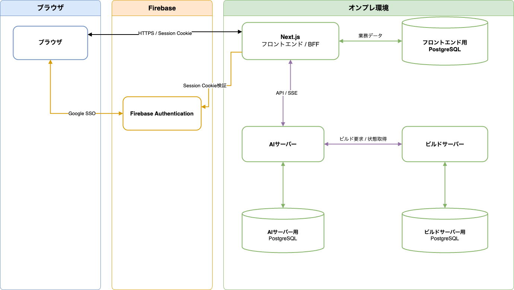

# システム構成

## 1. 対象範囲

- システムを構成するサービスと配置先
- 各コンポーネントの責務
- コンポーネント間の通信方向
- 認証、データアクセスおよびサービス間通信の境界
- AI 生成ジョブとビルドジョブの配送方針
- ビルド成果物の保存および取得方針

API、データ構造、ジョブ制御、移行および運用の詳細設計は対象外とします。

## 2. 構成

| 領域 | コンポーネント | 役割 |
| --- | --- | --- |
| ブラウザ | Next.js クライアント | ユーザー操作 |
| オンプレ環境 | Next.js + BFF | フロントエンド機能 |
| Firebase | Firebase Authentication | 認証基盤 |
| オンプレ環境 | フロントエンド用PostgreSQL | ユーザー、マシン、チャット、回答履歴を保存する |
| オンプレ環境 | AI サーバー | AI Job Queue からジョブを取得し、シナリオやコードを生成する |
| オンプレ環境 | ビルドサーバー | 隔離環境で Packer を実行して成果物を生成する |

### 2.1 フロントエンド／BFF

- 既存のNext.js 16アプリケーションをオンプレ環境のコンテナへ配置する
- フロントエンドとBFFは、同じNext.jsアプリケーションとして動作させる
- フロントエンドとBFFの既存の責務は維持する
- BFFは、ブラウザ、AIサーバーおよびDBの間に置く境界とする
- ブラウザ、AIサーバーおよびビルドサーバーからDBを直接操作しない

### 2.2 認証基盤

- 利用者認証にはFirebase Authenticationを使用する
- ログイン方式はGoogle SSOのみに限定する
- 認証・認可は、次の流れで行う
  1. ブラウザでGoogleログインを完了する
  2. ブラウザがFirebase ID tokenをBFFへ送信する
  3. BFFがID tokenを検証し、Firebase Session Cookieへ交換する
  4. BFFがSession Cookieに`Secure`、`HttpOnly`および適切な`SameSite`属性を付けてブラウザへ返す
  5. BFFがSession Cookieを検証し、適切な認可を行う
- メールアドレスとパスワードによる登録、保存、再設定および認証は提供しない

### 2.3 データストア

- フロントエンド用PostgreSQLへの読み書きは、フロントエンド専用DBユーザーで行う
- 利用者単位の認可はBFFで実施する
- ブラウザ、AIサーバーおよびビルドサーバーには、フロントエンド用PostgreSQLの資格情報を配布しない
- フロントエンド用PostgreSQLは既存のFirestoreデータを引き継がず、空の状態から開始する
- Firebase Authenticationの既存利用者は、次回ログイン時にFirebase UIDを主キーとしてフロントエンド用PostgreSQLへ自動登録する
- スキーマは `frontend/db/migrations/` のSQLをデプロイ時に適用し、通常のアプリケーション起動処理からDDLを実行しない

### 2.4 ジョブキューとオンプレ環境

- AIサーバーは、フロントエンドサーバーのHTTP Pull Consumerとして動作する
- AIサーバーは、自身が処理可能なときだけ外向きHTTPS通信でジョブを取得する
- ジョブの入力取得、進捗通知および結果登録には、BFFの内部APIを使用する
- 具体的な制御は、後続の Issue で定める

### 2.5 ビルド成果物

- VMイメージなどの大容量ビルド成果物は、オンプレ環境に保存する
- 配置場所や通信経路は別 Issue で解決する

## 3. セキュリティ境界

詳細は後続 Issue に任せますが、以下の方針を想定します。

| 通信元 | 通信先 | 認証 |
| --- | --- | --- |
| ブラウザ | Firebase Authentication | Firebase Authentication |
| ブラウザ | Next.js / BFF | Firebase Session Cookie |
| Next.js / BFF | フロントエンド用PostgreSQL | フロントエンド専用DBユーザー |
| AI・ビルドサーバー | BFF 内部 API | サーバー別 Bearer token |
