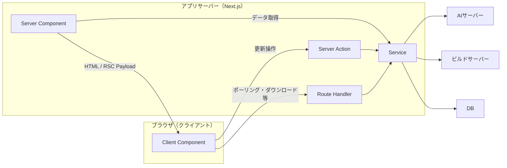

# フロントエンド設計

## 1. 本ドキュメントの目的

- 本ドキュメントは、SLSG のフロントエンドアプリケーションの設計及び責務の方針を示し、以降の実装を進める際の指針とすることを目的とする
- 対象：フロントエンドの構成・フロントエンドの責務・フロントエンドに持たせる機能
- 対象外：実装の詳細・認証認可・フロントエンドDB定義
- システム全体の基本方針は [システム仕様書](./spec.md) に従う

## 2. 構成



ブラウザでは Client Component が動作する。Next.js アプリサーバーは Server Component の提供、BFF としての Server Action・Route Handler・Service の提供を行う。接続先外部システムとして、AI サーバー・ビルドサーバー・DB が存在する。

ユーザーによる操作は Client Component から Server Action に渡し、ポーリングやダウンロードなどの HTTP を介した操作は Route Handler に渡す。

Server Action と Route Handler はそれぞれ Service を経由して業務処理を行う。

画面の初期表示や画面遷移時は、Server Component が Service から表示用データを取得し、SSR の結果をブラウザへ返す。

Service はブラウザから直接呼び出さない BFF 内部の業務処理であり、AI サーバー・ビルドサーバー・DBとの通信を担う。

## 3. 各構成要素の役割

### 3.1 Client Component

Client Component はブラウザ上で動作し、利用者との対話を担当する。Server Component から返される HTML および React Server Components Payload を基に画面を表示し、画面の入力、ボタン操作、表示中のUI状態を扱う。下流システムおよび Service へ直接通信しない。

- 画面の入力欄、ボタン、一覧の表示などを行う
- シナリオ生成やビルド要求などの更新操作を Server Action へ渡す
- ビルド進捗の取得や成果物のダウンロードを Route Handler へ要求する

### 3.2 Server Component

Server Component は Next.js サーバー上で動作し、画面の初期表示および画面遷移時のサーバー描画を担当する。必要なデータは Service を直接呼び出して取得し、HTML および React Server Components Payload としてブラウザへ返す。

- 画面表示に必要なデータを取得し、画面を組み立てる
- HTML および React Server Components Payload をブラウザへ返し、Client Component の表示に必要なデータを渡す
- ブラウザ上のイベント処理や継続的なUI状態の管理は行わない

### 3.3 Server Action

Server Action は、React のフォーム送信やボタン操作に対応する Next.js サーバー側の関数である。シナリオの生成やビルド要求など、利用者による更新操作の入口として使用する。下流システムとの通信方法・接続先・応答形式は Service に隠蔽する。

```text
「仮想マシンを作成」ボタン
   ↓
createMachineAction(入力値)
   ↓
仮想マシン生成リクエスト Service
```

Server Action の責務は次のとおりである。
- Client Component から受け取った入力を検証する
- 認証済み利用者の権限を確認する
- 対応する Service を呼び出す
- Service の結果を UI 向けに返す

### 3.4 Route Handler

Route Handler は、Next.js 内で HTTP リクエストを受け取り、HTTP レスポンスを返す入口である。通常の更新操作には使用せず、HTTP メソッド、レスポンスヘッダー、ストリーミングなどを利用する必要がある場合に使用する。

採用する用途は次のとおりである。

| 用途 | Server Action ではなく Route Handler を使う理由 |
|---|---|
| ビルド進捗のポーリング | ブラウザが繰り返し `GET` で状態を取得するため、進捗取得が HTTP の読み取り操作であることを明確にできる |
| 成果物のダウンロード | 大容量ファイルをストリームで返し、`Range` や `Content-Disposition` などの HTTP ヘッダーを扱うため（これはブラウザから直接ダウンロードする場合もある） |

Route Handler 自身も、下流サービスの呼び出しは Service に委譲する。

### 3.5 Service

Service は、Next.js サーバーの内部に置くサーバー専用の処理である。Server Component、Server Action、Route Handler から呼び出され、AI サーバー、ビルドサーバー、DBとの通信を集約する。ブラウザから直接呼び出さない。

Service の責務は次のとおりである。

- AI サーバー、ビルドサーバー、DB との通信を一箇所にまとめる
- 下流サービスごとのデータ形式を、画面で利用する形式へ変換する
- 複数の下流サービスから得た情報を必要に応じてまとめる
