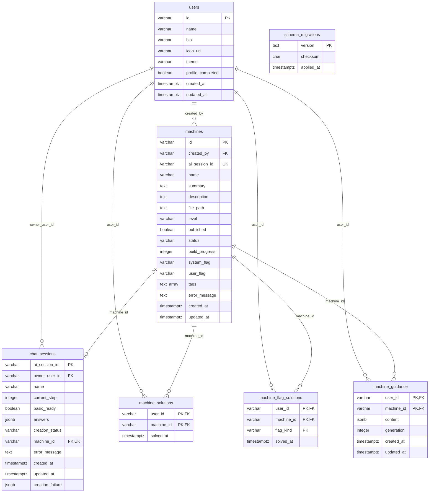

# フロントエンド DB 仕様

フロントエンド DB には PostgreSQL v17 を使用する。スキーマの正本は `frontend/db/migrations/` 以下の sql ファイルである。

## ER図

## users

ログイン利用者のプロフィール。`id` には Firebase UID を保存する。

| カラム名 | 型 | 主キー | 外部キー | nullable | 説明 |
|---|---|---|---|---|---|
| `id` | `varchar(128)` | ○ | — | 不可 | Firebase UID |
| `name` | `varchar(256)` | — | — | 不可 | 表示名（1〜256文字） |
| `bio` | `varchar(500)` | — | — | 不可 | 自己紹介 |
| `icon_url` | `varchar(2048)` | — | — | 不可 | プロフィール画像 URL |
| `theme` | `varchar(5)` | — | — | 不可 | テーマ（light / dark） |
| `profile_completed` | `boolean` | — | — | 不可 | プロフィール設定済みか |
| `created_at` | `timestamptz` | — | — | 不可 | 作成日時 |
| `updated_at` | `timestamptz` | — | — | 不可 | 更新日時 |

## machines

利用者が作成した演習マシン。公開状態、ビルド状態、フラグ正解値などを保持する。

| カラム名 | 型 | 主キー | 外部キー | nullable | 説明 |
|---|---|---|---|---|---|
| `id` | `varchar(128)` | ○ | — | 不可 | マシン ID |
| `created_by` | `varchar(128)` | — | `users.id` | 不可 | 作成者 |
| `ai_session_id` | `varchar(128)` | — | — | 可 | AI セッション ID（一意） |
| `name` | `varchar(40)` | — | — | 不可 | マシン名（1〜40文字） |
| `summary` | `text` | — | — | 不可 | 旧サマリー（現行アプリでは未使用） |
| `description` | `text` | — | — | 不可 | 詳細説明 |
| `file_path` | `text` | — | — | 不可 | 成果物のパス |
| `level` | `varchar(6)` | — | — | 不可 | 難易度（easy / medium / hard） |
| `published` | `boolean` | — | — | 不可 | 公開状態 |
| `status` | `varchar(10)` | — | — | 不可 | 状態（created / building / ready / failed / cancelled / preparing / deleted） |
| `build_progress` | `integer` | — | — | 不可 | ビルド進捗（0〜100） |
| `system_flag` | `varchar(200)` | — | — | 不可 | System flag の正解値 |
| `user_flag` | `varchar(200)` | — | — | 不可 | User flag の正解値 |
| `tags` | `text[]` | — | — | 不可 | タグ |
| `error_message` | `text` | — | — | 可 | エラー内容 |
| `created_at` | `timestamptz` | — | — | 不可 | 作成日時 |
| `updated_at` | `timestamptz` | — | — | 不可 | 更新日時 |

## chat_sessions

マシン作成チャットの入力内容と生成状態。AI セッション ID を主キーとする。

| カラム名 | 型 | 主キー | 外部キー | nullable | 説明 |
|---|---|---|---|---|---|
| `ai_session_id` | `varchar(128)` | ○ | — | 不可 | AI セッション ID |
| `owner_user_id` | `varchar(128)` | — | `users.id` | 不可 | 所有者 |
| `name` | `varchar(40)` | — | — | 不可 | 作成中のマシン名（1〜40文字） |
| `current_step` | `integer` | — | — | 不可 | 現在ステップ（1〜9） |
| `basic_ready` | `boolean` | — | — | 不可 | 基本設定の入力完了状態 |
| `answers` | `jsonb` | — | — | 不可 | チャット回答（JSON オブジェクト） |
| `creation_status` | `varchar(20)` | — | — | 不可 | 作成状態（input / generating_scenario / building / completed / failed / cancelled） |
| `machine_id` | `varchar(128)` | — | `machines.id` | 可 | 作成したマシン ID（一意） |
| `error_message` | `text` | — | — | 可 | エラー内容 |
| `created_at` | `timestamptz` | — | — | 不可 | 作成日時 |
| `updated_at` | `timestamptz` | — | — | 不可 | 更新日時 |
| `creation_failure` | `jsonb` | — | — | 可 | 作成失敗の詳細（JSON オブジェクト） |

## machine_solutions

利用者が他人のマシンに存在する全フラグを正解した事実を、利用者とマシンの組で記録する。解答済みマシン一覧にも使用する。

| カラム名 | 型 | 主キー | 外部キー | nullable | 説明 |
|---|---|---|---|---|---|
| `user_id` | `varchar(128)` | ○ | `users.id` | 不可 | 解答者 |
| `machine_id` | `varchar(128)` | ○ | `machines.id` | 不可 | 対象マシン |
| `solved_at` | `timestamptz` | — | — | 不可 | 最後のフラグの正解日時 |

## machine_flag_solutions

利用者が正解したフラグを User / System 別に記録する。

| カラム名 | 型 | 主キー | 外部キー | nullable | 説明 |
|---|---|---|---|---|---|
| `user_id` | `varchar(128)` | ○ | `users.id` | 不可 | 解答者 |
| `machine_id` | `varchar(128)` | ○ | `machines.id` | 不可 | 対象マシン |
| `flag_kind` | `varchar(6)` | ○ | — | 不可 | フラグの種類（user / system） |
| `solved_at` | `timestamptz` | — | — | 不可 | 当該フラグの正解日時 |

## machine_guidance

利用者とマシンの組ごとに生成した誘導問題を保存する。

| カラム名 | 型 | 主キー | 外部キー | nullable | 説明 |
|---|---|---|---|---|---|
| `user_id` | `varchar(128)` | ○ | `users.id` | 不可 | 利用者 |
| `machine_id` | `varchar(128)` | ○ | `machines.id` | 不可 | 対象マシン |
| `content` | `jsonb` | — | — | 不可 | 誘導問題（JSON オブジェクト） |
| `generation` | `integer` | — | — | 不可 | 生成回数（1以上） |
| `created_at` | `timestamptz` | — | — | 不可 | 作成日時 |
| `updated_at` | `timestamptz` | — | — | 不可 | 更新日時 |

## schema_migrations

`db/migrate.ts` が適用済みマイグレーションを管理するためのテーブル。アプリケーションの画面データには使用しない。

| カラム名 | 型 | 主キー | 外部キー | nullable | 説明 |
|---|---|---|---|---|---|
| `version` | `text` | ○ | — | 不可 | 適用した SQL ファイル名 |
| `checksum` | `char(64)` | — | — | 不可 | SQL の SHA-256 チェックサム |
| `applied_at` | `timestamptz` | — | — | 不可 | 適用日時 |

## 補足

- 外部キーの削除動作はすべて `ON DELETE RESTRICT`。参照されている行は削除できない。
- `machines.ai_session_id` は一意だが外部キーではない。`chat_sessions.machine_id` は一意の外部キーであり、作成完了前は NULL にできる。
- `machine_solutions` は「存在する全フラグを正解した他人のマシン」を 1 件で表し、`machine_flag_solutions` はフラグごとの正解履歴を表す。既存の部分正解・自作マシンの完了履歴は移行時に除外する。旧データからフラグ別履歴を補完できるのは、フラグが 1 種類だけのマシンに限る。
